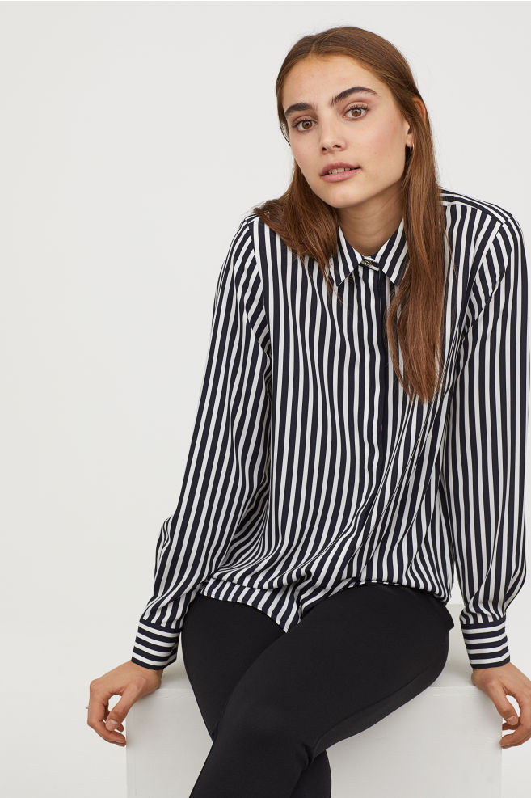

# Travel clothes

for women who want to be super comfy and still look put together! This is a living document and contributions are encouraged (see the end of the page for more details)

## "Travel uniform" ideas

"Leggings and an oversized shirt with vans/sneakers. I usually go with the white and black striped one [here](http://www2.hm.com/en_gb/productpage.0688873015.html) and roll up the sleeves and feels a bit tidier but still comfy due to baggy fit (which allows for sports bra if want to be super comfy etc)." -Sheree

"Not sure how grown up but my travel uniform is black tank top, black short or long sleeve shirt depending on season, black or gray cashmere sweater with black pants and black nikes. Always bring a scarf. Can wear any layer on its own. Can handle any weather, spill or delay." -Jessica

## Pants

"i’m basically head to toe @thisisADAY when i travel. particularly love...**the throw & roll leggings** (which have a very convenient pocket so i can stash my phone when i need my hands free)" -Tracy

"[Girlfriend leggings](https://www.girlfriend.com/collections/leggings). I love the compression feeling but many women I know don’t so YMMV." -L

"[Everlane chinos](https://www.everlane.com/products/womens-easy-chino-washedblack)" -L

"[Trekkie pants by Athleta](https://athleta.gap.com/browse/product.do?pid=210531). The photos on the page are not that good IMO, I think they look much better than the pictures. I have all the colors :)" -G

## Shirts

"An oversized shirt like [this one](http://www2.hm.com/en_gb/productpage.0688873015.html) over leggings. Roll up the sleeves and feels a bit tidier but still comfy due to baggy fit (which allows for sports bra if want to be super comfy etc)" -Sheree

## Outer Layers

"I carry a lightweight 'blanket' throw over arms or legs or use as pillow." -Paula

"i’m basically head to toe @thisisADAY when i travel. particularly love the **up in the air jacket**" -Tracy

"[The Red-Eye Wrap](https://www.betabrand.com/womens-black-red-eye-travel-wrap-cardigan) as a warm layer for overnight flights. It does get bulky so it’s not super flattering for normal sweater weather - but its my go to for international flights because of the huge zipper pockets inside it for passports etc and the long sleeves + eye/ear covering part let me sleep even more comfortably with an eye mask and ear plugs on" -L

## Underwear & Bras

"I do a racerback bra with front hook so I can unlatch during longer flights." -Christina

"I got these [Bra-lellujah Bralettes](https://www.spanx.com/shops/new/bra-llelujah-bralette) recommended in a Slack I’m in and have now bought five of them. They are perfect for everyday wear but ESPECIALLY GREAT for plane travel" -L

"The [True Body](https://trueandco.com/collections/true-body-bras-underwear) line of bras from True & Co. They look atrocious but are incredibly comfortable—kind of like a sports bra but better. I was skeptical but saw them say something like '90% of our employees hated the way they looked initially but now wear them every week'. Also good for when you're wearing a sheer shirt but don't want a bra to show.' -Sasha

## Shoes & Socks

"When traveling in the winter I'll wear my biggest shoes (usually knee boots) on the plane to save suitcase space, and then take them off and wear big fluffy socks while in transit." -Sasha

# Contributions welcome

Please feel free to submit pull requests with suggestions! Since this is all one page, you can even edit it right in your browser without cloning the repo—just hit the Edit button. 

Please be specific. When possible, link to specific items. If it's sold out, try to include a similar product to illustrate. 

This particular project is laser focused on the intersection of comfort and style. It's easy to be comfortable and it's easy to be stylish but it's really hard to be both! Ideas should be right in that sweet spot and may be rejected if they're too far in either direction. They should be clothes or other wearable garments, not earphones and other travel tools. 

# Contributors

